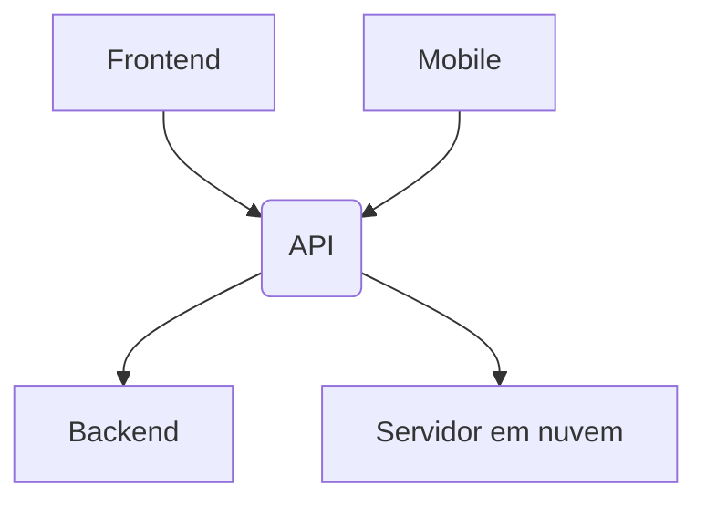

# API

Interface de programação de aplicativos.

Conjunto de regras e padrões de comunicação entre softwares.

Comunicação entre softwares, seja entre um frontend e um backend, ou um mobile e um servidor em nuvem.



## Tipos de APIs

### REST

APIs REST são APIs que seguem o modelo arquitetural REST.

O modelo REST é baseado em recursos, que são identificados por URLs.

Por exemplo, um recurso de usuário pode ser identificado por `/users`.

Esse recurso é altamente baseado em verbos, como `GET /users/list` para listar usuários, `POST /users/create` para criar um usuário, `PUT /users/update` para atualizar um usuário e `DELETE /users/delete` para deletar um usuário.

Exemplo de uma requisição REST:

```http
GET /users/list
POST /users/create
```

### SOAP

APIs SOAP são APIs que seguem o protocolo SOAP.

O protocolo SOAP é baseado em XML e é altamente baseado em ações.

Pode usar o protocolo HTTP para comunicação, mas também pode usar outros protocolos, como SMTP.

É um formato mais antigo que o REST, mas ainda é amplamente utilizado em sistemas legados.

Exemplo de uma requisição SOAP:

```xml
<soapenv:Envelope xmlns:soapenv="http://schemas.xmlsoap.org/soap/envelope/" xmlns:tem="http://tempuri.org/">
   <soapenv:Header/>
   <soapenv:Body>
      <tem:GetUser>
         <tem:UserId>1</tem:UserId>
      </tem:GetUser>
   </soapenv:Body>
</soapenv:Envelope>
```

Nesse exemplo, a ação é `GetUser` e o parâmetro é `UserId`.

### Event-Driven APIs

APIs orientadas a eventos são APIs que são baseadas em eventos. Essas não dependem de requisições, como a REST, mas sim de gatilhos de eventos, como um usuário se cadastrando em um site, ou um pagamento sendo aprovado.

Essas APIs são altamente escaláveis e podem lidar com um grande número de eventos simultaneamente.

Exemplo de uma API orientada a eventos:

````javascript
const event = {
  type: 'user_registered',
  data: {
    userId: 1,
    name: 'John Doe',
    email: 'johndoe@email.com',
    },
}

// Enviar o evento para um serviço de mensageria
sendMessage(event)

// Receber o evento e processá-lo
receiveMessage(event => {
  if (event.type === 'user_registered') {
    createUser(event.data)
  }
})

// Criar um usuário
function createUser(data) {
  console.log(`Criando usuário ${data.name} com email ${data.email}`)
}
````

Nesse exemplo, um evento de `user_registered` é enviado para um serviço de mensageria, que então é recebido e processado por um serviço que cria um usuário.

### GraphQL

GraphQL é uma linguagem de consulta para APIs e um tempo de execução para executar essas consultas.

É uma alternativa ao REST e SOAP, e é altamente flexível, permitindo que o cliente especifique exatamente quais dados ele deseja.

É capaz de fazer consultas aninhadas, o que significa que você pode obter dados de várias tabelas em um único pedido.

Exemplo de uma consulta GraphQL:

```graphql
query {
  user(id: 1) {
    name
    email
    posts {
      title
      content
    }
  }
}
```

Nesse exemplo, estamos consultando um usuário com o ID 1, e queremos obter seu nome, email e os títulos e conteúdos de seus posts.

### gRPC

_Remote Procedure Call_ (RPC) é um protocolo que um programa pode usar para solicitar um serviço de um programa localizado em outro computador em uma rede sem ter que entender a rede.

A comunicação é baseada em chamadas de procedimento remoto, onde um programa chama um procedimento em outro computador como se fosse um procedimento local.

gRPC é um framework RPC de código aberto desenvolvido pelo Google que usa o protocolo HTTP/2 para comunicação.

Ele é altamente eficiente, pois usa serialização binária para transferir dados, e é altamente escalável, pois pode lidar com várias chamadas de procedimento simultaneamente.

Exemplo de uma chamada de procedimento remoto com gRPC:

```protobuf
service UserService {
  rpc GetUser(UserRequest) returns (UserResponse) {}
}

message UserRequest {
  int32 user_id = 1;
}

message UserResponse {
  string name = 1;
  string email = 2;
}
```

Nesse exemplo, temos um serviço de usuário com um método `GetUser` que recebe um `UserRequest` com um ID de usuário e retorna um `UserResponse` com o nome e email do usuário.

### HTTP headers

Os cabeçalhos HTTP são usados para transmitir informações adicionais entre o cliente e o servidor.

Alguns cabeçalhos comuns incluem:

- `Content-Type`: O tipo de conteúdo da requisição ou resposta.
- `Authorization`: Informações de autenticação para acessar um recurso protegido.
- `User-Agent`: Informações sobre o navegador ou cliente que está fazendo a requisição.
- `Cookie`: Informações armazenadas no navegador do cliente.
- `Cache-Control`: Instruções sobre como o conteúdo deve ser armazenado em cache.

Exemplo de cabeçalhos HTTP:

```http
GET /users/list HTTP/1.1
Host: api.example.com
Content-Type: application/json
Authorization Bearer: token
```

## Anatomia de um projeto

### Import e Export

Em JavaScript, você pode importar e exportar funções e variáveis de um módulo para outro.

Esses imports podem ser feitos de várias maneiras, ente elas:

#### Importando

- Utiliando o `require`:

```javascript
const express = require('express')
```

Para utilizar o require, no entanto, é necessário que o módulo seja um módulo CommonJS.

```json
{
  "type": "commonjs"
}
```

- Utilizando o `import`:

```javascript
import express from 'express'
```

Para utilizar o import, é necessário que o módulo seja um módulo ES.

```json
{
  "type": "module"
}
```

#### Package.json

O package.json é um arquivo que contém metadados sobre o projeto, como nome, versão, descrição, scripts, dependências e muito mais.

Ele é o arquivo base para projetos Node.js e é usado para gerenciar o projeto, instalar dependências, executar scripts e muito mais.

Ele possui a seguinte anatomia:

```json
{
  "name": "my-project",
  "version": "1.0.0",
  "description": "Meu projeto",
  "main": "index.js",
  "author": "John Doe",
  "license": "ISC",
  "module": "module",
  "scripts": {
    "start": "node index.js"
  },
  "dependencies": {
    "express": "^4.17.1"
  },
  "devDependencies": {
    "nodemon": "^2.0.7"
  }
}
```

Onde:

- `name`: Nome do projeto.
- `version`: Versão do projeto, seguindo o padrão SemVer.
- `description`: Descrição do projeto (opcional).
- `main`: Arquivo principal do projeto.
- `author`: Autor do projeto.
- `license`: Licença do projeto, como MIT, ISC, Apache, etc.
- `module`: Módulo do projeto, como CommonJS ou ES.
- `scripts`: Scripts que podem ser executados com `npm run` ou `yarn`.
- `dependencies`: Dependências do projeto - serão instaladas quando o projeto for instalado.
- `devDependencies`: Dependências de desenvolvimento do projeto - serão instaladas apenas em ambiente de desenvolvimento, não sendo necessárias em produção.

Outros campos podem ser adicionados conforme necessário, como:

- `repository`: URL do repositório do projeto.
- `keywords`: Palavras-chave do projeto.
- `engines`: Versões do Node.js e do npm que o projeto suporta.
- `peerDependencies`: Dependências que o projeto requer que o consumidor instale.
- `browserslist`: Lista de navegadores suportados pelo projeto.

#### Nodemon

Nodemon é uma ferramenta que ajuda a desenvolver aplicativos Node.js reiniciando automaticamente o aplicativo quando os arquivos são alterados.

Instalamos com o comando:

```bash
npm install -g nodemon # Instalação global
npm install --save-dev nodemon # Instalação local
```

Utilizamos ele adicionado um script no `package.json`:

```json
{
  "scripts": {
    "start": "node index.js",
    "dev": "nodemon index.js"
  }
}
```

E então executamos o script com:

```bash
npm run dev
```

### Portas

Portas são usadas para identificar processos em um sistema operacional.

Portas comuns:

- 80: HTTP
- 8080: HTTP alternativo
- 443: HTTPS
- 3306: MySQL
- 27017: MongoDB
- 5432: PostgreSQL
- 587: SMTP
- 22: SSH
