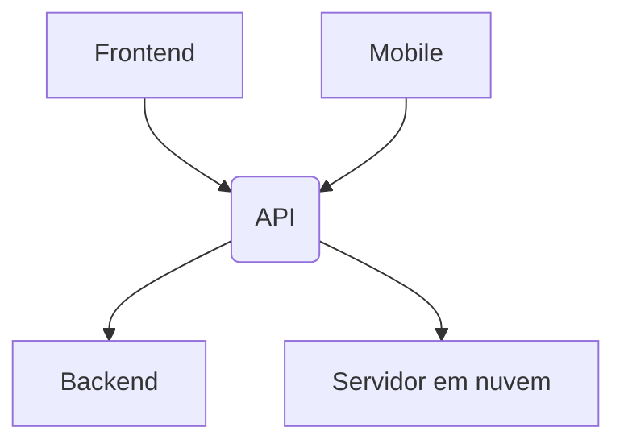

# API

Interface de programação de aplicativos.

Conjunto de regras e padrões de comunicação entre softwares.

Comunicação entre softwares, seja entre um frontend e um backend, ou um mobile e um servidor em nuvem.



## Tipos de APIs

### REST

APIs REST são APIs que seguem o modelo arquitetural REST.

O modelo REST é baseado em recursos, que são identificados por URLs.

Por exemplo, um recurso de usuário pode ser identificado por `/users`.

Esse recurso é altamente baseado em verbos, como `GET /users/list` para listar usuários, `POST /users/create` para criar um usuário, `PUT /users/update` para atualizar um usuário e `DELETE /users/delete` para deletar um usuário.

Exemplo de uma requisição REST:

```http
GET /users/list
POST /users/create
```

### SOAP

APIs SOAP são APIs que seguem o protocolo SOAP.

O protocolo SOAP é baseado em XML e é altamente baseado em ações.

Pode usar o protocolo HTTP para comunicação, mas também pode usar outros protocolos, como SMTP.

É um formato mais antigo que o REST, mas ainda é amplamente utilizado em sistemas legados.

Exemplo de uma requisição SOAP:

```xml
<soapenv:Envelope xmlns:soapenv="http://schemas.xmlsoap.org/soap/envelope/" xmlns:tem="http://tempuri.org/">
   <soapenv:Header/>
   <soapenv:Body>
      <tem:GetUser>
         <tem:UserId>1</tem:UserId>
      </tem:GetUser>
   </soapenv:Body>
</soapenv:Envelope>
```

Nesse exemplo, a ação é `GetUser` e o parâmetro é `UserId`.

### Event-Driven APIs

APIs orientadas a eventos são APIs que são baseadas em eventos. Essas não dependem de requisições, como a REST, mas sim de gatilhos de eventos, como um usuário se cadastrando em um site, ou um pagamento sendo aprovado.

Essas APIs são altamente escaláveis e podem lidar com um grande número de eventos simultaneamente.

Exemplo de uma API orientada a eventos:

````javascript
const event = {
  type: 'user_registered',
  data: {
    userId: 1,
    name: 'John Doe',
    email: 'johndoe@email.com',
    },
}

// Enviar o evento para um serviço de mensageria
sendMessage(event)

// Receber o evento e processá-lo
receiveMessage(event => {
  if (event.type === 'user_registered') {
    createUser(event.data)
  }
})

// Criar um usuário
function createUser(data) {
  console.log(`Criando usuário ${data.name} com email ${data.email}`)
}
````

Nesse exemplo, um evento de `user_registered` é enviado para um serviço de mensageria, que então é recebido e processado por um serviço que cria um usuário.

### GraphQL

GraphQL é uma linguagem de consulta para APIs e um tempo de execução para executar essas consultas.

É uma alternativa ao REST e SOAP, e é altamente flexível, permitindo que o cliente especifique exatamente quais dados ele deseja.

É capaz de fazer consultas aninhadas, o que significa que você pode obter dados de várias tabelas em um único pedido.

Exemplo de uma consulta GraphQL:

```graphql
query {
  user(id: 1) {
    name
    email
    posts {
      title
      content
    }
  }
}
```

Nesse exemplo, estamos consultando um usuário com o ID 1, e queremos obter seu nome, email e os títulos e conteúdos de seus posts.

### gRPC

_Remote Procedure Call_ (RPC) é um protocolo que um programa pode usar para solicitar um serviço de um programa localizado em outro computador em uma rede sem ter que entender a rede.

A comunicação é baseada em chamadas de procedimento remoto, onde um programa chama um procedimento em outro computador como se fosse um procedimento local.

gRPC é um framework RPC de código aberto desenvolvido pelo Google que usa o protocolo HTTP/2 para comunicação.

Ele é altamente eficiente, pois usa serialização binária para transferir dados, e é altamente escalável, pois pode lidar com várias chamadas de procedimento simultaneamente.

Exemplo de uma chamada de procedimento remoto com gRPC:

```protobuf
service UserService {
  rpc GetUser(UserRequest) returns (UserResponse) {}
}

message UserRequest {
  int32 user_id = 1;
}

message UserResponse {
  string name = 1;
  string email = 2;
}
```

Nesse exemplo, temos um serviço de usuário com um método `GetUser` que recebe um `UserRequest` com um ID de usuário e retorna um `UserResponse` com o nome e email do usuário.

### HTTP headers

Os cabeçalhos HTTP são usados para transmitir informações adicionais entre o cliente e o servidor.

Alguns cabeçalhos comuns incluem:

- `Content-Type`: O tipo de conteúdo da requisição ou resposta.
- `Authorization`: Informações de autenticação para acessar um recurso protegido.
- `User-Agent`: Informações sobre o navegador ou cliente que está fazendo a requisição.
- `Cookie`: Informações armazenadas no navegador do cliente.
- `Cache-Control`: Instruções sobre como o conteúdo deve ser armazenado em cache.

Exemplo de cabeçalhos HTTP:

```http
GET /users/list HTTP/1.1
Host: api.example.com
Content-Type: application/json
Authorization Bearer: token
```

## Anatomia de um projeto

### Import e Export

Em JavaScript, você pode importar e exportar funções e variáveis de um módulo para outro.

Esses imports podem ser feitos de várias maneiras, ente elas:

#### Importando

- Utiliando o `require`:

```javascript
const express = require('express')
```

Para utilizar o require, no entanto, é necessário que o módulo seja um módulo CommonJS.

```json
{
  "type": "commonjs"
}
```

- Utilizando o `import`:

```javascript
import express from 'express'
```

Para utilizar o import, é necessário que o módulo seja um módulo ES.

```json
{
  "type": "module"
}
```

#### Package.json

O package.json é um arquivo que contém metadados sobre o projeto, como nome, versão, descrição, scripts, dependências e muito mais.

Ele é o arquivo base para projetos Node.js e é usado para gerenciar o projeto, instalar dependências, executar scripts e muito mais.

Ele possui a seguinte anatomia:

```json
{
  "name": "my-project",
  "version": "1.0.0",
  "description": "Meu projeto",
  "main": "index.js",
  "author": "John Doe",
  "license": "ISC",
  "module": "module",
  "scripts": {
    "start": "node index.js"
  },
  "dependencies": {
    "express": "^4.17.1"
  },
  "devDependencies": {
    "nodemon": "^2.0.7"
  }
}
```

Onde:

- `name`: Nome do projeto.
- `version`: Versão do projeto, seguindo o padrão SemVer.
- `description`: Descrição do projeto (opcional).
- `main`: Arquivo principal do projeto.
- `author`: Autor do projeto.
- `license`: Licença do projeto, como MIT, ISC, Apache, etc.
- `module`: Módulo do projeto, como CommonJS ou ES.
- `scripts`: Scripts que podem ser executados com `npm run` ou `yarn`.
- `dependencies`: Dependências do projeto - serão instaladas quando o projeto for instalado.
- `devDependencies`: Dependências de desenvolvimento do projeto - serão instaladas apenas em ambiente de desenvolvimento, não sendo necessárias em produção.

Outros campos podem ser adicionados conforme necessário, como:

- `repository`: URL do repositório do projeto.
- `keywords`: Palavras-chave do projeto.
- `engines`: Versões do Node.js e do npm que o projeto suporta.
- `peerDependencies`: Dependências que o projeto requer que o consumidor instale.
- `browserslist`: Lista de navegadores suportados pelo projeto.

#### Nodemon

Nodemon é uma ferramenta que ajuda a desenvolver aplicativos Node.js reiniciando automaticamente o aplicativo quando os arquivos são alterados.

Instalamos com o comando:

```bash
npm install -g nodemon # Instalação global
npm install --save-dev nodemon # Instalação local
```

Utilizamos ele adicionado um script no `package.json`:

```json
{
  "scripts": {
    "start": "node index.js",
    "dev": "nodemon index.js"
  }
}
```

E então executamos o script com:

```bash
npm run dev
```

### Portas

Portas são usadas para identificar processos em um sistema operacional.

Portas comuns:

- 80: HTTP
- 8080: HTTP alternativo
- 443: HTTPS
- 3306: MySQL
- 27017: MongoDB
- 5432: PostgreSQL
- 587: SMTP
- 22: SSH

## DotEnv

DotEnv é uma biblioteca que carrega variáveis de ambiente de um arquivo `.env` para o `process.env`.

Isso é útil para armazenar informações sensíveis, como chaves de API, senhas e tokens de acesso, fora do código-fonte.

### Instalação

Instalamos o DotEnv com o comando:

```bash
npm install dotenv
```

### Uso

Para usar o DotEnv, criamos um arquivo `.env` na raiz do projeto com as variáveis de ambiente:

```
PORT=3000
```

E então carregamos essas variáveis no código-fonte com:

```javascript
require('dotenv').config() // Carrega as variáveis de ambiente do arquivo .env com o type: module
import 'dotenv/config' // Carrega as variáveis de ambiente do arquivo .env com o type: commonjs

const port = process.env.PORT || 3000; // Seta uma variável de ambiente ou um valor padrão
```

## Express

Express é um framework web para Node.js que simplifica o desenvolvimento de aplicativos web. Ele fornece uma série de recursos para criar APIs RESTful, servir arquivos estáticos, lidar com rotas, middlewares e muito mais.

### Instalação

Instalamos o express com o comando:

```bash
npm install express
```

### Servidor

Para criar um servidor com Express, fazemos o seguinte:

```javascript
const express = require('express')

const app = express()

app.get('/', (req, res) => {
  res.send('Hello, World!')
})

app.listen(3000, () => {
  console.log('Servidor rodando na porta 3000')
})
```

Nesse exemplo, criamos um servidor Express que escuta na porta 3000 e responde com "Hello, World!" quando acessamos a raiz do servidor.

### Rotas

Rotas são usadas para mapear URLs para funções que lidam com essas URLs.

Podemos definir rotas em Express da seguinte maneira:

```javascript
app.get('/users', (req, res) => {
  res.send('Lista de usuários')
})

app.post('/users', (req, res) => {
  res.send('Criar usuário')
})

app.put('/users/:id', (req, res) => {
  res.send(`Atualizar usuário com ID ${req.params.id}`)
})

app.delete('/users/:id', (req, res) => {
  res.send(`Deletar usuário com ID ${req.params.id}`)
})
```

Nesse exemplo, definimos rotas para listar usuários, criar um usuário, atualizar um usuário e deletar um usuário.

## Anatomia de uma requisição HTTP

### Métodos HTTP

Os métodos HTTP são usados para indicar a ação que deve ser realizada em um recurso.

Alguns métodos comuns incluem:

- `GET`: Obter um recurso.
- `POST`: Criar um recurso.
- `PUT`: Atualizar um recurso.
- `DELETE`: Deletar um recurso.
- `PATCH`: Atualizar parcialmente um recurso.
- `HEAD`: Obter cabeçalhos de resposta.
- `OPTIONS`: Obter métodos HTTP permitidos.

Exemplo de uma requisição HTTP:

```http
GET /users/list HTTP/1.1
Host: api.example.com
Content-Type: application/json
Authorization Bearer: token
```

Nesse exemplo, estamos fazendo uma requisição `GET` para `/users/list` com o cabeçalho `Content-Type` definido como `application/json` e o cabeçalho `Authorization` definido como `Bearer: token`.

### Partes de uma requisição

As partes que podem compor uma requisição são:

- `URL`: O endereço do recurso que está sendo acessado, iniciado por `http://` ou `https://`.
- `Header`: Chamado também de cabeçalho, inclui informações adicionais sobre a requisição. Inclui dados como:
  - `host`: O host do servidor - por exemplo, `api.example.com`.
  - `user-agent`: O navegador ou cliente que está fazendo a requisição - por exemplo, `Mozilla/5.0`.
  - `content-type`: O tipo de conteúdo da requisição - por exemplo, `application/json`.
  - `authorization`: Informações de autenticação para acessar um recurso protegido - por exemplo, um token de acesso.
  - `accept`: O tipo de conteúdo que o cliente aceita - por exemplo, `application/json`.
- `Body`: O corpo da requisição, que contém os dados que estão sendo enviados para o servidor. Pode ser vazio, ou conter dados como:
  - `application/json`: Dados em formato JSON.
  - `application/x-www-form-urlencoded`: Dados em formato de formulário.
  - `multipart/form-data`: Dados em formato de formulário com arquivos.
- `Method`: O método HTTP que está sendo usado - por exemplo, `GET`, `POST`, `PUT`, `DELETE`.
- `Query`: Parâmetros de consulta que são enviados na URL - por exemplo, `?page=1&limit=10`.
- `Params`: Parâmetros de rota que são enviados na URL - por exemplo, `/users/1`.

### Partes de uma resposta

As partes que podem compor uma resposta são:

- `Status`: O código de status da resposta, que indica se a requisição foi bem-sucedida, falhou ou foi redirecionada. Alguns códigos de status comuns incluem:
  - `200 OK`: A requisição foi bem-sucedida.
  - `201 Created`: O recurso foi criado com sucesso.
  - `400 Bad Request`: A requisição foi malformada.
  - `401 Unauthorized`: O cliente não está autorizado a acessar o recurso.
  - `404 Not Found`: O recurso não foi encontrado.
  - `500 Internal Server Error`: O servidor encontrou um erro ao processar a requisição.
- `Header`: Chamado também de cabeçalho, inclui informações adicionais sobre a resposta. Inclui alguns dados semelhantes aos da requisição, como:
  - `content-type`: O tipo de conteúdo da resposta - por exemplo, `application/json`.
  - `content-length`: O tamanho do conteúdo da resposta.
  - `cache-control`: Instruções sobre como o conteúdo deve ser armazenado em cache.
  - `expires`: A data de expiração do conteúdo.
  - `set-cookie`: Informações sobre cookies que devem ser armazenados no navegador.
- `Body`: O corpo da resposta, que contém os dados que estão sendo enviados de volta para o cliente. Pode ser vazio, ou conter dados como:
  - `application/json`: Dados em formato JSON.
  - `text/html`: Dados em formato HTML.
  - `image/png`: Dados de uma imagem PNG.
  - `application/pdf`: Dados de um arquivo PDF.

## Models, Routes, Controllers e Services

### Models

Os modelos são usados para representar os dados de um aplicativo.
Em um sistema de banco de dados relacional, um modelo geralmente corresponde a uma tabela no banco de dados.

Por exemplo, em um sistema onde tenho usuários, eu teria um modelo de usuário que representaria a tabela de usuários no banco de dados.

```javascript
// User.js
const mongoose = require('mongoose');

const userSchema = new mongoose.Schema({
  name: String,
  email: String,
  password: String,
});

module.exports = mongoose.model('User', userSchema);
```

Nesse exemplo, temos um modelo de usuário que tem um nome, email e senha.

### Routes

Rotas são usadas para mapear URLs para funções que lidam com essas URLs.

Em um aplicativo Express, as rotas são usadas para definir o comportamento do aplicativo em diferentes URLs.

```javascript
// userRoutes.js
const express = require('express');

const router = express.Router();

router.get('/users', (req, res) => {
  res.send('Lista de usuários');
});

router.post('/users', (req, res) => {
  res.send('Criar usuário');
});

router.put('/users/:id', (req, res) => {
  res.send(`Atualizar usuário com ID ${req.params.id}`);
});

router.delete('/users/:id', (req, res) => {
  res.send(`Deletar usuário com ID ${req.params.id}`);
});

module.exports = router;
```

Nesse exemplo, temos rotas para listar usuários, criar um usuário, atualizar um usuário e deletar um usuário.

### Controllers

Controladores são usados para lidar com a lógica de negócios de um aplicativo.

Eles são responsáveis por receber as requisições do cliente, chamar os serviços necessários para processar essas requisições e retornar uma resposta ao cliente.

Geralmente, os controladores são usados para manter a lógica de negócios fora das rotas e manter as rotas limpas e organizadas.

É costume também criar uma classe para cada controlador, para manter a organização do código - mas isso não é uma regra.

```javascript
// userController.js
const User = require('./User');

class UserController {
  async listUsers(req, res) {
    const users = await User.find();
    res.json(users);
  }

  async createUser(req, res) {
    const user = new User(req.body);
    await user.save();
    res.json(user);
  }

  async updateUser(req, res) {
    const user = await User.findByIdAndUpdate(req.params.id, req.body, { new: true });
    res.json(user);
  }

  async deleteUser(req, res) {
    await User.findByIdAndDelete(req.params.id);
    res.json({ message: 'Usuário deletado com sucesso' });
  }
}
```

Nesse exemplo, temos um controlador de usuário que tem métodos para listar usuários, criar um usuário, atualizar um usuário e deletar um usuário.

### Services

Por sua vez, os serviços são usados para encapsular a lógica de negócios de um aplicativo.

Eles são responsáveis por executar operações específicas, como criar um usuário, atualizar um usuário, deletar um usuário, etc.

Verificações, validações e outras operações de negócios são feitas nos serviços, e não nos controladores.

```javascript
// userService.js

export async const createUser(data) {
  // Validações
  // Criptografia de senha
  // Criação de usuário
}

export async const updateUser(id, data) {
  // Validações
  // Atualização de usuário
}

export async const deleteUser(id) {
  // Validações
  // Deleção de usuário
}

export async const listUsers() {
  // Listagem de usuários
}
```

Nesse exemplo, temos um serviço de usuário que tem métodos para criar um usuário, atualizar um usuário e deletar um usuário.

### Organização

Por fim, a organização de um projeto pode ser feita da seguinte maneira:

```
src/
  controllers/
    userController.js
  models/
    User.js
  routes/
    userRoutes.js
  services/
    userService.js
```

E seguindo a seguinte estrutura:

```javascript
// userRoutes.js
const express = require('express');

const router = express.Router();

const UserController = require('../controllers/userController');
const userController = new UserController();

router.get('/users', userController.listUsers);
router.post('/users', userController.createUser);
router.put('/users/:id', userController.updateUser);
router.delete('/users/:id', userController.deleteUser);

module.exports = router;
```

```javascript
// userController.js
import {
  createUser,
  updateUser,
  deleteUser,
  listUsers,
} from '../services/userService';

class UserController {
  async listUsers(req, res) {
    const users = await listUsers();
    res.json(users);
  }

  async createUser(req, res) {
    const user = await createUser(req.body);
    res.json(user);
  }

  async updateUser(req, res) {
    const user = await updateUser(req.params.id, req.body);
    res.json(user);
  }

  async deleteUser(req, res) {
    await deleteUser(req.params.id);
    res.json({ message: 'Usuário deletado com sucesso' });
  }
}

module.exports = UserController;
```

```javascript
// userService.js

import UserModel from '../models/User';

export async const createUser(data) {
  // Validações
  // Criptografia de senha
  // Criação de usuário
}

export async const updateUser(id, data) {
  // Validações
  // Atualização de usuário
}

export async const deleteUser(id) {
  // Validações
  // Deleção de usuário
}

export async const listUsers() {
  // Listagem de usuários
}

```

```javascript
// User.js

const mongoose = require('mongoose');

const userSchema = new mongoose.Schema({
  name: String,
  email: String,
  password: String,
});

module.exports = mongoose.model('User', userSchema);
```

Essa é apenas uma estrutura de exemplo, e não engloba critérios de organização de código, como DRY, SOLID, etc.

